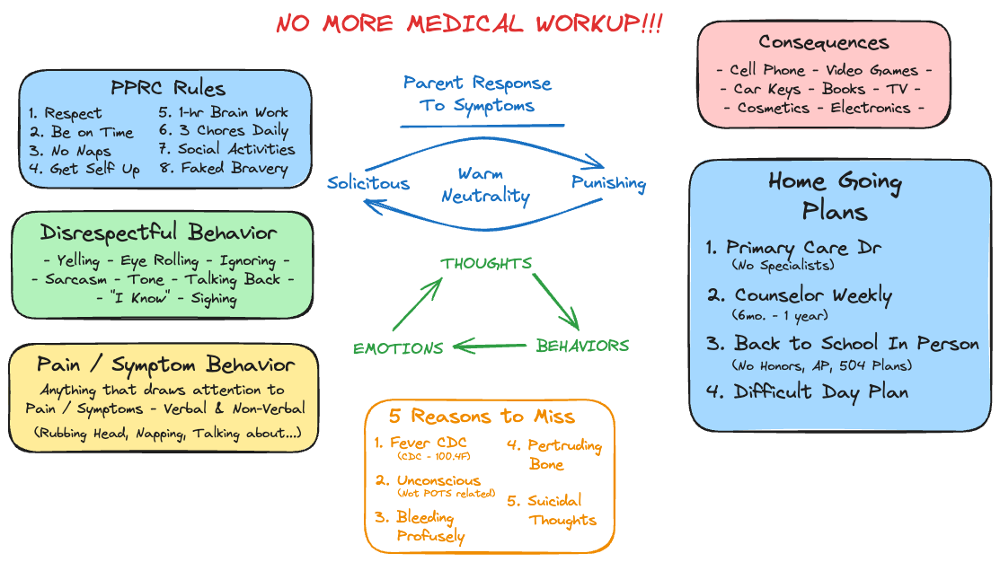

# Overview
I was fortunately enough to have been a part of Mayo Clinic's Pediatric Pain Rehabilitation Center (PPRC), and took a lot of notes during all the parent and family sessions.  Since some of the content involved links to videos and is in some way connected, I wanted to publish my notes in this interactive format, for the benefit of other parents and anyone else who may find this information useful.

# PPRC Starting Point
Just about everything you need to know about this program starts with the following diagram:

To get started with my notes, you should start with [PPRC Home](PPRC%20Home.md)

> [!warning] Warning
> This site represents one person's notes and opinion.  This site is NOT affiliated with Mayo Clinic in any way, and has not been reviewed or approved for treatment of any illness.  
> 
> This site is a collection of one persons's notes, no more.
> 
> If information in this site is interesting to you, you should definitely reach out to [Mayo Clinic](https://www.mayoclinic.org/departments-centers/pain-rehabilitation-center/sections/overview/ovc-20481691)

